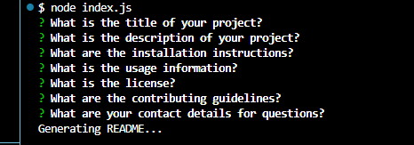

## Bri's Professional README.Generator 

## Description

Welcome to my Professional README.generator!
This project is a README.generator made for our Node Challenge. This help me understand the concept of inquirer better and it was fun to run node index.js. 

## Table of Contents 

- [Installation](#installation)
- [Usage](#usage)
- [License](#license)
- [Contribute](#how-to-contribute)
- [Questions](#questions) 

## Installation

Clone the Repo at git clone https://github.com/BriannaVitan/README.generator.git

## Usage

## License

This project is licensed under the MIT license. See LICENSE.txt for more information.

## How to Contribute

Contributions are welcomed and greatly appreciated. If you have a suggestion, please fork the repo and create a pull request. Thank you in advance!

## Questions

If you have any additional questions, please reach me at https://github.com/BriannaVitan/README.generator?tab=readme-ov-file